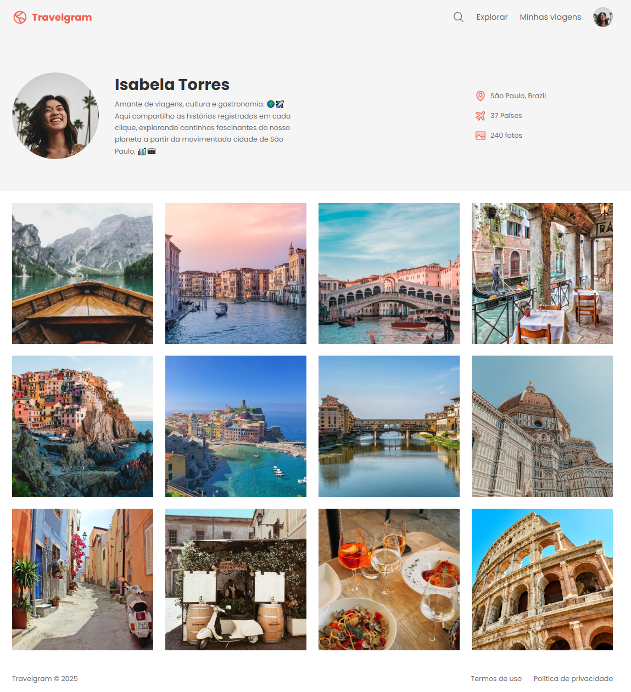

# 🌍 Travelgram

Este é um projeto de uma página web de perfil, focado em exibir imagens de viagens. O projeto foi desenvolvido utilizando **HTML** e **CSS**, com ênfase no uso de **display: flex** para criar um layout responsivo e organizado.

## 📌 Funcionalidades
- Exibição de imagens de destinos de viagem
- Layout responsivo e estilizado utilizando **flexbox**
- Design simples e fácil de personalizar

## 🖼️ Captura de Tela



## 🚀 Tecnologias Utilizadas
- **HTML5**
- **CSS3** com **display: flex**

## 📂 Como Utilizar
1. Clone este repositório:
   ```sh
   git clone https://github.com/nsbarros/travel-gram.git
   
2. Acesse a pasta do projeto:
   ```sh
   cd travel-gram
   
3. Abra o arquivo index.html no seu navegador.

📜 Licença
Este projeto está sob a licença MIT. Sinta-se à vontade para usá-lo e modificá-lo conforme necessário.
